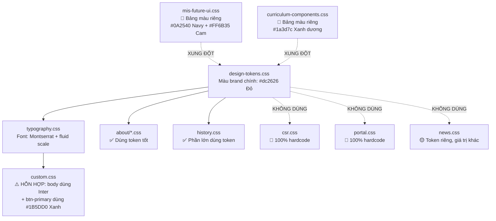

# 📋 Báo Cáo Kiểm Tra Giao Diện (UI Audit) — Website Trường MIS
**Ngày tạo:** 21/03/2026

---

## Tổng Quan

| Hạng mục | Số lượng |
|----------|---------|
| Tổng file CSS đã quét | 17 file (`static/css/`) |
| Tổng file HTML template đã quét | ~108 file |
| **Tổng lỗi phát hiện** | **87** |
| 🔴 Nghiêm trọng (Critical) | **12** — lỗi tương phản màu, font không tải, xung đột thương hiệu |
| 🟡 Cảnh báo (Warning) | **42** — hardcode màu, bỏ qua design token, trùng lặp |
| 🔵 Gợi ý (Info) | **33** — inline style, đề xuất cải thiện |

---

## Kiến Trúc Hệ Thống CSS Hiện Tại

Dự án đã có hệ thống design token khá tốt trong `design-tokens.css` + `typography.css`, nhưng **mức độ áp dụng không đồng đều**. Nhiều file CSS module hoàn toàn bỏ qua hệ thống token.



---

## 🔴 Lỗi Nghiêm Trọng (Critical)

### C1. Ba Bảng Màu Thương Hiệu Xung Đột Nhau

Dự án đang sử dụng **ba bảng màu brand khác nhau**, gây mất đồng nhất thị giác khi người dùng di chuyển giữa các trang:

| Hệ thống | Màu chính | File | Dùng ở đâu |
|----------|-----------|------|------------|
| **Đỏ (Brand chính)** | `#dc2626` | [design-tokens.css:14](file:///d:/NGHIA/WebsiteSchool/static/css/design-tokens.css#L14) | Trang About, Lịch sử, WhyMIS |
| **Xanh dương (Button)** | `#1B5DD0` | [custom.css:154](file:///d:/NGHIA/WebsiteSchool/static/css/custom.css#L154) | Nút CTA trang chủ, link trong prose |
| **Navy + Cam** | `#0A2540` + `#FF6B35` | [mis-future-ui.css:8](file:///d:/NGHIA/WebsiteSchool/static/css/mis-future-ui.css#L8) | Trang cấp học (Mầm non, Tiểu học, THCS, THPT) |
| **Xanh Curriculum** | `#1a3d7c` | [curriculum-components.css:9](file:///d:/NGHIA/WebsiteSchool/static/css/curriculum-components.css#L9) | Trang chương trình học |

> [!CAUTION]
> Khi người dùng điều hướng từ trang chủ (nút CTA **xanh dương**) sang trang About (nút CTA **đỏ**), họ cảm nhận sự thay đổi thương hiệu đột ngột. Điều này làm giảm tính chuyên nghiệp và độ tin cậy của website.

**Cách sửa đề xuất:** Thống nhất về một màu brand chính duy nhất. Nếu thương hiệu trường là đỏ (`#dc2626`), thì `.btn-primary` trong `custom.css` nên dùng `var(--color-brand-primary)` thay vì `#1B5DD0`.

---

### C2. Font Chữ Khai Báo Sai — Inter Được Khai Báo Nhưng Không Được Tải

| File | Dòng | Khai báo | Vấn đề |
|------|------|----------|--------|
| [custom.css](file:///d:/NGHIA/WebsiteSchool/static/css/custom.css#L83) | 83 | `font-family: 'Inter', system-ui, sans-serif` | Inter **KHÔNG** được tải trong base.html |
| [typography.css](file:///d:/NGHIA/WebsiteSchool/static/css/typography.css#L2) | 2 | `--font-sans: "Montserrat"` | Montserrat **CÓ** được tải |
| [base.html](file:///d:/NGHIA/WebsiteSchool/templates/base.html#L38) | 38 | Google Fonts tải `Montserrat:wght@400;500;600;700;800` | Chỉ có Montserrat |

> [!CAUTION]
> `custom.css` khai báo `font-family: 'Inter'` cho body nhưng chỉ có Montserrat được tải qua Google Fonts. Trình duyệt sẽ **bỏ qua Inter** và dùng `system-ui` làm fallback, tạo ra trải nghiệm **font không nhất quán** giữa các thiết bị. Ngoài ra, khai báo body trong custom.css **ghi đè** lên hệ thống typography.css (dùng `var(--font-sans)` = Montserrat).

**Cách sửa:** Xóa dòng `font-family` trong custom.css body (dòng 82-85) và để `typography.css` + `design-tokens.css` quản lý font.

---

### C3. Lỗi Tương Phản Màu (WCAG AA)

Chuẩn WCAG AA yêu cầu tỷ lệ tương phản tối thiểu **4.5:1** cho chữ thường và **3:1** cho chữ lớn (≥18px đậm hoặc ≥24px).

| File | Dòng | Màu chữ | Màu nền | Tỷ lệ | Đạt? |
|------|------|---------|---------|--------|------|
| [custom.css](file:///d:/NGHIA/WebsiteSchool/static/css/custom.css#L437) | 437 | `#94a3b8` (placeholder) | `#ffffff` | **2.86:1** | 🔴 KHÔNG ĐẠT |
| [portal.css](file:///d:/NGHIA/WebsiteSchool/static/css/portal.css#L134) | 134 | `#6b7280` (th text) | `#f3f4f6` | **3.86:1** | 🔴 KHÔNG ĐẠT |
| [news.css](file:///d:/NGHIA/WebsiteSchool/static/css/news.css#L66) | 66 | `rgba(255,255,255,0.6)` | nền gradient tối | ~**3.2:1** | 🔴 KHÔNG ĐẠT |
| [csr.css](file:///d:/NGHIA/WebsiteSchool/static/css/csr.css#L250) | 250 | `#64748b` (stat-label) | `#ffffff` | **4.62:1** | 🟡 Sát ranh giới |
| [custom.css](file:///d:/NGHIA/WebsiteSchool/static/css/custom.css#L131) | 131 | `#64748b` (section-subtitle) | `#ffffff` | **4.62:1** | 🟡 Sát ranh giới |

**Cách sửa:**
- Placeholder: đổi `#94a3b8` → `#64748b` (tỷ lệ 4.62:1)
- Portal th: đổi `#6b7280` → `#4b5563` (tỷ lệ 5.91:1)
- News breadcrumb: đổi opacity từ `0.6` → `0.75`

---

## 🟡 Cảnh Báo (Warning)

### W1. `csr.css` — Bỏ Qua Hoàn Toàn Hệ Thống Token (2547 dòng, 0 tham chiếu token)

[csr.css](file:///d:/NGHIA/WebsiteSchool/static/css/csr.css) là file CSS **lớn nhất** (2547 dòng) và **không sử dụng bất kỳ biến CSS** nào từ design-tokens. Tất cả giá trị đều được hardcode trực tiếp.

**Mẫu các giá trị hardcode (không đầy đủ):**

| Dòng | Thuộc tính | Giá trị hardcode | Nên dùng |
|------|-----------|-----------------|----------|
| 91 | color | `#ffffff` | `var(--color-text-on-dark)` |
| 153 | background | `#ffffff` | `var(--color-surface-light)` |
| 169 | background | `#ffffff` | `var(--color-surface-light)` |
| 223 | color | `#dc2626` | `var(--color-brand-primary)` |
| 239 | color | `#0f172a` | `var(--color-text-primary)` |
| 250 | color | `#64748b` | `var(--color-text-muted)` |
| 263 | background | `#ffffff` | `var(--color-surface-light)` |
| 278 | color | `#dc2626` | `var(--color-brand-primary)` |
| 292 | color | `#0f172a` | `var(--color-text-primary)` |
| 304 | color | `#475569` | `var(--color-text-secondary)` |
| 330 | color | `#b91c1c` | `var(--color-brand-primary-dark)` |
| 385 | background | `#f8fafc` | `var(--color-neutral-50)` |
| 425 | color | `#0f172a` | `var(--color-text-primary)` |
| 435 | color | `#64748b` | `var(--color-text-muted)` |
| 538 | color | `#0f172a` | `var(--color-text-primary)` |
| 549 | color | `#64748b` | `var(--color-text-muted)` |

> [!WARNING]
> Nếu sau này cần đổi bảng màu brand hoặc hỗ trợ Dark Mode cho trang CSR, sẽ phải sửa **hàng trăm** dòng thay vì chỉ đổi vài biến CSS.

---

### W2. `portal.css` — Bỏ Qua Hoàn Toàn Hệ Thống Token (250 dòng, 0 tham chiếu token)

[portal.css](file:///d:/NGHIA/WebsiteSchool/static/css/portal.css) hardcode mọi giá trị màu.

| Dòng | Thuộc tính | Giá trị hardcode | Nên dùng |
|------|-----------|-----------------|----------|
| 2 | background | `#f9fafb` | `var(--color-neutral-50)` |
| 9 | color | `#0f172a` | `var(--color-text-primary)` |
| 14 | color | `#64748b` | `var(--color-text-muted)` |
| 28 | background | `#ffffff` | `var(--color-surface-light)` |
| 52 | border | `#e2e8f0` | `var(--color-neutral-200)` |
| 65 | color | `#0f172a` | `var(--color-text-primary)` |
| 72 | color | `#dc2626` | `var(--color-brand-primary)` |
| 134 | color | `#6b7280` | `var(--color-neutral-500)` |
| 143 | color | `#2563eb` | Nên dùng màu brand |
| 165 | border-color | `#2563eb` | Nên dùng màu brand |

---

### W3. `news.css` — Định Nghĩa Token Riêng, Xung Đột Với Token Chung

[news.css](file:///d:/NGHIA/WebsiteSchool/static/css/news.css#L7) tạo token riêng nhưng giá trị **khác** với hệ thống chung:

| Token cục bộ (news) | Giá trị cục bộ | Token chung | Giá trị chung | Khớp? |
|---------------------|---------------|-------------|---------------|-------|
| `--brand-primary-500` | `#b91c1c` | `--color-brand-primary` | `#dc2626` | ❌ Khác |
| `--brand-primary-700` | `#991b1b` | `--color-brand-primary-dark` | `#b91c1c` | ❌ Khác |
| `--content-strong` | `#0f172a` | `--color-text-primary` | `#171717` | ❌ Khác |
| `--content-muted` | `#64748b` | `--color-text-muted` | `#525252` | ❌ Khác |

> [!WARNING]
> Điều này có nghĩa trang Tin tức có **sắc thái màu khác biệt** so với các trang khác — ví dụ nút active trên trang Tin tức dùng `#b91c1c` (đỏ tối hơn) trong khi trang About dùng `#dc2626` (đỏ sáng hơn).

---

### W4. Trùng Lặp Định Nghĩa `.section-title`

Lớp `.section-title` được định nghĩa ở **hai nơi** với giá trị mâu thuẫn:

| File | Cỡ chữ | Weight | Màu |
|------|--------|--------|-----|
| [custom.css:110](file:///d:/NGHIA/WebsiteSchool/static/css/custom.css#L110) | `2.5rem` → `3rem` → `3.5rem` (theo breakpoint) | `800` | `#0E2A5C` (navy hardcode) |
| [typography.css:103](file:///d:/NGHIA/WebsiteSchool/static/css/typography.css#L103) | `var(--fs-h2)` = `clamp(1.75rem → 2.25rem)` | (kế thừa) | (kế thừa) |

Do custom.css tải **sau** typography.css, giá trị hardcode `2.5rem` + `#0E2A5C` sẽ **ghi đè** lên fluid type scale.

---

### W5. Hardcode Màu Trong `custom.css`

| Dòng | Thuộc tính | Giá trị | Token đề xuất |
|------|-----------|---------|---------------|
| 48 | color | `#ffffff` | `var(--color-text-on-dark)` |
| 78 | background | gradient `#0f172a`, `#020617` | Dùng `--color-neutral-900/950` |
| 114 | color | `#0E2A5C` | ⚠️ Không có trong token — cần quyết định brand |
| 131 | color | `#64748b` | `var(--color-text-muted)` |
| 137 | background | `white` | `var(--color-surface-light)` |
| 154 | background | `#1B5DD0` | Nên dùng `var(--color-brand-primary)` |
| 163 | background | `#164AA6` | Nên dùng `var(--color-brand-primary-dark)` |
| 183 | color | `#1B5DD0` | Nên dùng `var(--color-brand-primary)` |
| 285 | color | `#0E2A5C` | Không có trong token |
| 303 | color | `#1B5DD0` | Nên dùng `var(--color-brand-primary)` |

---

### W6. Dùng `white` Thay Vì Biến CSS — 35+ Lần

Tìm thấy **35+ lần** sử dụng `color: white` hoặc `background: white` trong CSS:

| File | Số lần | Nên dùng |
|------|--------|----------|
| design-tokens.css | 13 | `var(--color-text-on-dark)` / `var(--color-surface-light)` |
| custom.css | 2 | tương tự |
| about/future_ai.css | 3 | tương tự |
| about/edtech.css | 2 | tương tự |
| csr.css | 20+ | tương tự |

---

### W7. `mis-future-ui.css` — Hệ Thống Thiết Kế Hoàn Toàn Riêng Biệt

[mis-future-ui.css](file:///d:/NGHIA/WebsiteSchool/static/css/mis-future-ui.css) (1502 dòng) định nghĩa một **hệ thống thiết kế độc lập hoàn toàn** với:
- Màu brand khác: `--mis-navy: #0A2540`, `--mis-coral: #FF6B35`
- Token bề mặt riêng: `--mis-bg: #F7F9FC`, `--mis-surface: #FFFFFF`
- Token bo góc riêng: `--mis-radius: 16px`, `--mis-radius-lg: 24px`  
- Token đổ bóng riêng: `--mis-shadow`, `--mis-shadow-lg`

File này được dùng cho **trang cấp học** (Mầm non, Tiểu học, THCS, THPT). Tuy việc dùng bảng màu riêng có thể là chủ đích, nhưng nó khiến các trang này **khác biệt thị giác** so với phần còn lại của website.

---

### W8. `curriculum-components.css` — Thêm Một Hệ Màu Riêng

[curriculum-components.css](file:///d:/NGHIA/WebsiteSchool/static/css/curriculum-components.css) (1733 dòng) định nghĩa:
- `--curriculum-accent-primary: #1a3d7c` (xanh dương, **không phải** đỏ brand)
- `--curriculum-accent-secondary: #4f9cf7`
- `--curriculum-accent-tertiary: #7c3aed`
- `--curriculum-gold: #d4a853`

Và dùng rất nhiều màu hardcode: `#dce5f3`, `#e8f1ff`, `#e4eeff`, `#0a1628`, v.v.

---

## 🔵 Gợi Ý Cải Thiện (Info)

### I1. Inline Style Trong Template — 413+ Lần

Các template portal là phần vi phạm nặng nhất với thuộc tính `style=""` inline:

| Nhóm Template | ~Số lần | Mẫu phổ biến |
|--------------|--------|---------------|
| portal/pages/ | ~25 | `display:flex`, `font-size:.7rem`, `text-align:right` |
| portal/news/ | ~20 | `display:flex`, `font-size:.65rem`, `max-width:400px` |
| portal/media/ | ~15 | `display:flex`, `gap:8px`, `font-size:.7rem` |
| portal/login.html | ~5 | `color:#5eead4`, `color:#38bdf8`, `color:#a78bfa` |
| portal/events/ | ~10 | Tương tự |
| core/home.html | ~50+ | Nhiều inline style hỗn hợp |

> [!TIP]
> Nên tạo các lớp tiện ích cho các mẫu phổ biến, ví dụ: `.d-flex-gap-sm { display: flex; gap: 8px; }` và `.icon-xs { font-size: 0.7rem; }` để giảm lượng inline style.

---

### I2. Font Không Nhất Quán Trong Portal

| Template | Khai báo font |
|----------|--------------|
| [login.html:26](file:///d:/NGHIA/WebsiteSchool/templates/portal/login.html#L26) | `font-family: 'Inter', system-ui, sans-serif` |
| [login.html:179](file:///d:/NGHIA/WebsiteSchool/templates/portal/login.html#L179) | `font-family: 'Inter', sans-serif` (thiếu fallback) |
| [partners.html:255](file:///d:/NGHIA/WebsiteSchool/templates/about/partners.html#L255) | `font-family: Georgia, serif` (có thể chủ đích cho trích dẫn?) |
| Các form TinyMCE (4 file) | `font-family: 'Inter', sans-serif` |
| [403.html](file:///d:/NGHIA/WebsiteSchool/templates/403.html#L19) / 404 / 500 | `font-family: "Montserrat", ui-sans-serif, system-ui...` (hardcode) |

---

### I3. Dùng `px` Cố Định Thay Vì `rem`/`em`

Nhiều file dùng pixel cố định thay vì đơn vị tương đối:

| File | Ví dụ |
|------|-------|
| portal.css | `padding: 20px`, `gap: 16px`, `margin-bottom: 24px` |
| custom.css | `padding: 80px 0` / `100px 0` / `120px 0` cho .section |
| csr.css | `border-radius: 24px`, `padding: 2.5rem` (✅ nhưng trộn lẫn) |

---

### I4. Sử Dụng `!important`

| File | Dòng | Khai báo |
|------|------|----------|
| [history.css:230](file:///d:/NGHIA/WebsiteSchool/static/css/history.css#L230) | 230 | `color: #fff !important` |
| [history.css:234](file:///d:/NGHIA/WebsiteSchool/static/css/history.css#L234) | 234 | `color: rgba(255,255,255,.65) !important` |

---

## Bảng Tổng Hợp Lỗi Theo File

| File | 🔴 Nghiêm trọng | 🟡 Cảnh báo | 🔵 Gợi ý | Tổng |
|------|-----------------|------------|----------|------|
| custom.css | 2 | 8 | 3 | **13** |
| csr.css | 1 | 12 | 2 | **15** |
| portal.css | 2 | 8 | 2 | **12** |
| news.css | 1 | 5 | 1 | **7** |
| design-tokens.css | 0 | 6 | 2 | **8** |
| history.css | 0 | 3 | 2 | **5** |
| mis-future-ui.css | 1 | 0 | 2 | **3** |
| curriculum-components.css | 1 | 0 | 2 | **3** |
| typography.css | 0 | 0 | 1 | **1** |
| about/whymis.css | 0 | 0 | 3 | **3** |
| about/mission.css | 0 | 0 | 2 | **2** |
| pdf-images.css | 0 | 0 | 1 | **1** |
| Templates (tất cả) | 3 | 0 | 10 | **13** |
| **TỔNG** | **12** | **42** | **33** | **87** |

---

## Đề Xuất Biến CSS Bổ Sung (Design Tokens)

Hệ thống [design-tokens.css](file:///d:/NGHIA/WebsiteSchool/static/css/design-tokens.css) hiện tại **khá tốt** nhưng cần:

1. **Mở rộng** thêm alias ngữ nghĩa cho các module page
2. **Bắt buộc áp dụng** — csr.css, portal.css, và news.css phải chuyển sang dùng token

### Token đề xuất bổ sung vào `design-tokens.css`:

```css
:root {
    /* ── Alias Ngữ Nghĩa Cho Trang ── */
    
    /* Chữ trên nền tối/hero */
    --text-on-dark: var(--color-text-on-dark);         /* #ffffff */
    --text-on-dark-soft: rgba(255, 255, 255, 0.85);
    --text-on-dark-muted: rgba(255, 255, 255, 0.65);
    
    /* Bề mặt (surface) thông dụng */
    --surface-card: var(--color-surface-light);
    --surface-page: var(--color-neutral-50);
    
    /* Viền (border) chuẩn */
    --border-default: var(--color-neutral-200);         /* #e5e5e5 */
    --border-subtle: rgba(15, 23, 42, 0.06);
    
    /* Token cho form */
    --form-placeholder: var(--color-neutral-400);       /* #a3a3a3 — đạt WCAG trên nền trắng */
    --form-border: var(--color-neutral-300);
    --form-focus-ring: var(--color-brand-primary);
    
    /* Rút gọn màu chữ */
    --text-heading: var(--color-text-primary);
    --text-body: var(--color-text-secondary);
    --text-caption: var(--color-text-muted);
}
```

---

## Tóm Tắt Lỗi Typography (Kiểu Chữ)

| File | Dòng | Giá trị hiện tại | Vấn đề | Đề xuất sửa |
|------|------|-----------------|--------|-------------|
| custom.css | 83 | `font-family: 'Inter'` | Inter không được tải; xung đột với typography.css | Xóa; để `var(--font-sans)` áp dụng |
| custom.css | 88 | `font-family: 'Montserrat'` | Trùng lặp với typography.css | Xóa; dùng `var(--font-display)` |
| custom.css | 110 | `font-size: 2.5rem` (.section-title) | Ghi đè fluid type scale | Dùng `var(--fs-h2)` |
| portal/login.html | 26 | `font-family: 'Inter'` | Font không được tải | Dùng `var(--font-sans)` hoặc tải Inter |
| partners.html | 255 | `font-family: Georgia, serif` | Khác font site | 🟡 Có thể chủ đích cho trích dẫn |
| 403/404/500.html | 19 | `font-family: "Montserrat"...` | Hardcode thay vì dùng biến | Dùng `var(--font-sans)` nếu CSS được tải |

---

## Kế Hoạch Sửa Lỗi Ưu Tiên

### 🚀 Giai đoạn 1 — Sửa Nhanh (< 1 giờ)

| # | Việc cần làm | Mức ảnh hưởng |
|---|-------------|--------------|
| 1 | **Sửa xung đột font**: Xóa custom.css dòng 82-85 (body font-family) để typography.css quản lý | Cao |
| 2 | **Sửa lỗi tương phản**: Đổi placeholder `#94a3b8` → `#64748b`, portal th `#6b7280` → `#4b5563` | Cao |
| 3 | **Thống nhất `.btn-primary`**: Dùng `var(--color-brand-primary)` hoặc quyết định dứt khoát giữa xanh và đỏ | Cao |

### 🔧 Giai đoạn 2 — Chuyển Đổi Token (~4 giờ)

| # | Việc cần làm | Mức ảnh hưởng |
|---|-------------|--------------|
| 4 | Chuyển **portal.css** sang dùng design token | Trung bình |
| 5 | Chuyển **news.css** token cục bộ sang tham chiếu token chung | Trung bình |
| 6 | Thay `color: white` → `var(--color-text-on-dark)` trong design-tokens.css | Thấp |

### 🏗️ Giai đoạn 3 — Tái Cấu Trúc Toàn Diện (~8 giờ)

| # | Việc cần làm | Mức ảnh hưởng |
|---|-------------|--------------|
| 7 | Chuyển **csr.css** sang dùng design token (file lớn nhất) | Trung bình |
| 8 | Căn chỉnh **curriculum-components.css** accent về màu brand | Trung bình |
| 9 | Xem xét **mis-future-ui.css** — quyết định bảng màu riêng có chủ đích hay không | Thấp |
| 10 | Tách inline style từ template portal thành lớp tiện ích | Thấp |

---

## Lưu Ý Về Bước 4 (Tự Động Sửa)

> [!IMPORTANT]
> Việc tự động sửa (auto-fix) **chưa được thực hiện** vì các lý do sau:
> 
> 1. **Quyết định màu brand** (đỏ `#dc2626` hay xanh `#1B5DD0`) đòi hỏi **quyết định từ ban giám hiệu/bộ phận truyền thông** — tự động sửa sẽ thay đổi giao diện
> 2. `csr.css` và `mis-future-ui.css` có bảng màu phức tạp, có thể là **thiết kế chủ đích** cần review của designer
> 3. Inline style trong portal chủ yếu dùng biến CSS riêng (`var(--p-danger)`, `var(--p-gray-800)`) — thuộc hệ thống thiết kế portal riêng
>
> **Khuyến nghị:** Thực hiện **Giai đoạn 1** trước, sau đó xác nhận bảng màu nào là chuẩn rồi tiếp tục Giai đoạn 2 & 3.

---

*Báo cáo được tạo bởi UI Auditor — 21/03/2026*
